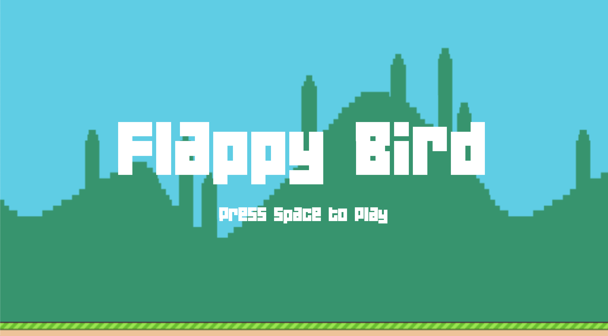
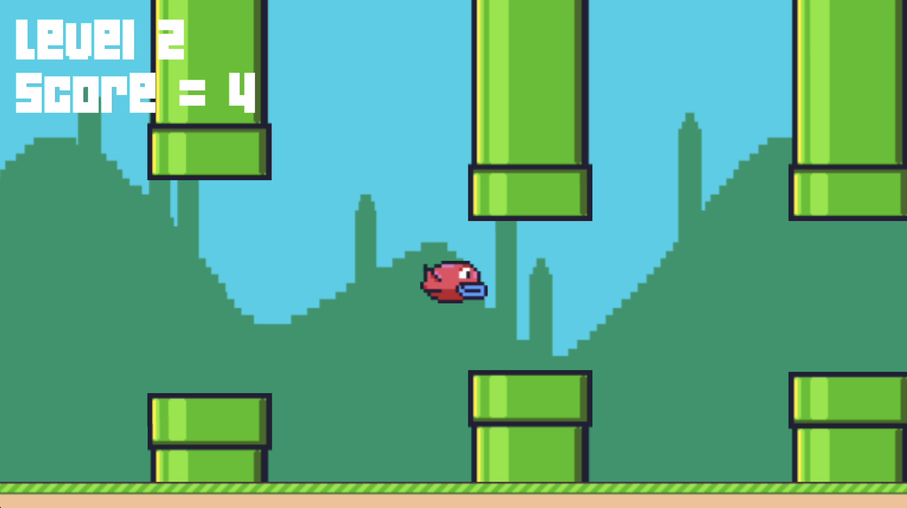

## Flappy Bird

L'objectif de la deuxième semaine de la formation GD50 de l'université Harvard était de recréer le jeu populaire Flappy Bird avec le moteur de jeu LÖVE2D et le language de programmation Lua

Les sujets abordés sont les suivants:

- L'utilisation de Sprites
- le défilement Infini et l'illusion des jeux
- la génération procédurale
- Les State Machines
- Intégration de la souris
- Intégration de musique

Pour y jouer, vous devez tout d'abord télécharger le moteur LÖVE2D disponible ci-dessous:

https://love2d.org/#download

Vous pouvez maintenant télécharger et lancer le fichier du jeu "FlappyBird.love".

